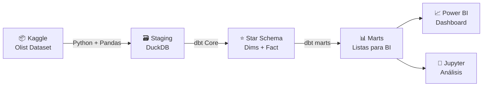
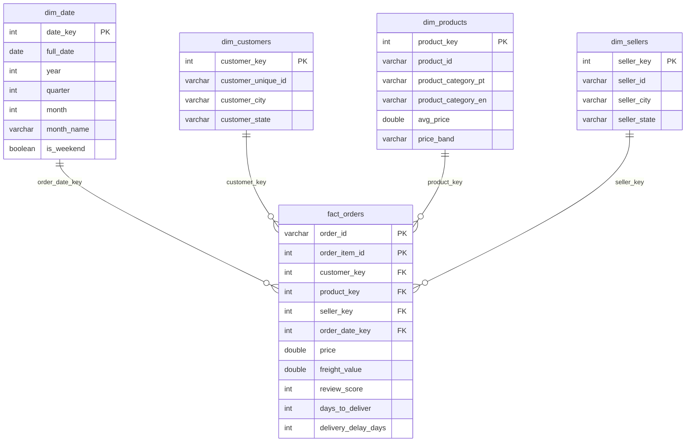

# 📊 Retail Analytics Data Warehouse

**Data Warehouse de retail con pipeline ETL/ELT completo**, construido como proyecto de portfolio para demostrar competencias en analytics engineering.

> Simulación de un entorno analítico para un equipo de retail — similar al rol de un Profesional de Datos Senior en empresas como KOAJ (Permoda Ltda.)

---

## 🎯 Problema de Negocio

Un equipo de retail necesita insights accionables sobre:
- **Ventas:** ¿Cuál es el revenue por región, categoría y período? ¿Cuál es el ticket promedio?
- **Clientes:** ¿Dónde se concentran los clientes? ¿Cómo varía la satisfacción por región?
- **Logística:** ¿Cuánto tarda la entrega promedio? ¿Qué estados tienen peor performance logístico?

Este proyecto construye la infraestructura de datos que responde esas preguntas, desde la ingesta de datos crudos hasta dashboards ejecutivos.

---

## 🏗️ Arquitectura



| Capa | Herramienta | Propósito |
|------|-------------|-----------|
| Ingesta (ETL) | Python + Pandas | Validación y carga a staging |
| DWH local | DuckDB | Motor SQL analítico sin servidor |
| Transformaciones | dbt Core | Modelos ELT, tests, documentación |
| Análisis | Jupyter Notebook | EDA y validación de métricas |
| Visualización | Power BI Desktop | Dashboard final para el portfolio |

---

## ⭐ Star Schema (Modelo Dimensional)



> **Granularidad:** Cada fila en `fact_orders` representa un ítem dentro de una orden. Una orden con 3 productos genera 3 filas.

---

## 📂 Estructura del Proyecto

```
retail-analytics-dwh/
├── 01_ingestion/              ← Pipeline ETL: descarga, validación, carga
├── 02_warehouse/              ← DDL del star schema: dims + fact
├── 03_transform/              ← Proyecto dbt Core
│   ├── models/
│   │   ├── staging/           ← 9 modelos + sources (views)
│   │   ├── intermediate/      ← 2 modelos de joins enriquecidos (views)
│   │   └── marts/             ← 3 marts finales para Power BI (tables)
│   ├── dbt_project.yml
│   └── profiles.yml           ← Conexión a DuckDB
├── 04_analysis/               ← Notebooks de EDA y análisis de KPIs
├── 05_dashboards/             ← Dashboard Power BI + screenshots
└── data/raw/                  ← CSV crudos (no versionados)
```

---

## 📊 Dataset

**[Olist Brazilian E-Commerce](https://www.kaggle.com/datasets/olistbr/brazilian-ecommerce)** — ~100.000 órdenes reales de e-commerce brasileño (2016–2018).

9 archivos CSV que cubren: órdenes, ítems, clientes, vendedores, productos, pagos, reseñas y geolocalización.

---

## 🚀 Cómo Ejecutar

```bash
# 1. Clonar el repositorio
git clone https://github.com/jsebastianbetancurd-web/retail-analytics-dwh.git
cd retail-analytics-dwh

# 2. Crear entorno virtual e instalar dependencias
python -m venv .venv
.venv\Scripts\activate        # Windows
pip install -r requirements.txt

# 3. Configurar Kaggle API (requiere token)
# Establecer variable de entorno KAGGLE_API_TOKEN

# 4. Descargar dataset
python 01_ingestion/download_dataset.py

# 5. Ejecutar pipeline ETL
python 01_ingestion/validate_raw.py
python 01_ingestion/load_to_staging.py

# 6. Construir star schema
python 02_warehouse/build_warehouse.py

# 7. Ejecutar transformaciones dbt (14 modelos + 23 tests)
cd 03_transform
dbt run --profiles-dir .
dbt test --profiles-dir .

# 8. (Opcional) Ver documentación con DAG de linaje
dbt docs generate --profiles-dir .
dbt docs serve --profiles-dir .
```

---

## 🛠️ Estado del Proyecto

- [x] Etapa 1 — Setup del entorno y descarga del dataset
- [x] Etapa 2 — Pipeline ETL: validación y carga a staging
- [x] Etapa 3 — Modelado del Data Warehouse: Star Schema
- [x] Etapa 4 — Transformaciones ELT con dbt Core (14 modelos, 23 tests)
- [ ] Etapa 5 — Análisis, Power BI y README final

---

## 👤 Autor

**Jose Betancur** — Economista cuantitativo en transición hacia Analytics Engineering.

[](https://www.linkedin.com/in/jsebastianbetancurd/)
[](https://github.com/jsebastianbetancurd-web)
